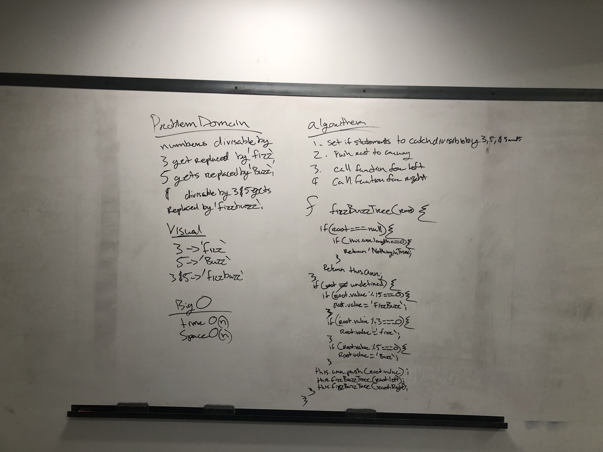

# BizzBuzzTree

 
## Challenge

To replace integers that are divisible by 3 -> 'fizz', by 5 -> 'buzz' and both -> 'fizzbuzz'.  

## Approach & Efficiency

I want to set a couple of if statement to check if the value is divisible by 3, 5, and 3 & 5.

## Challenge 

;
