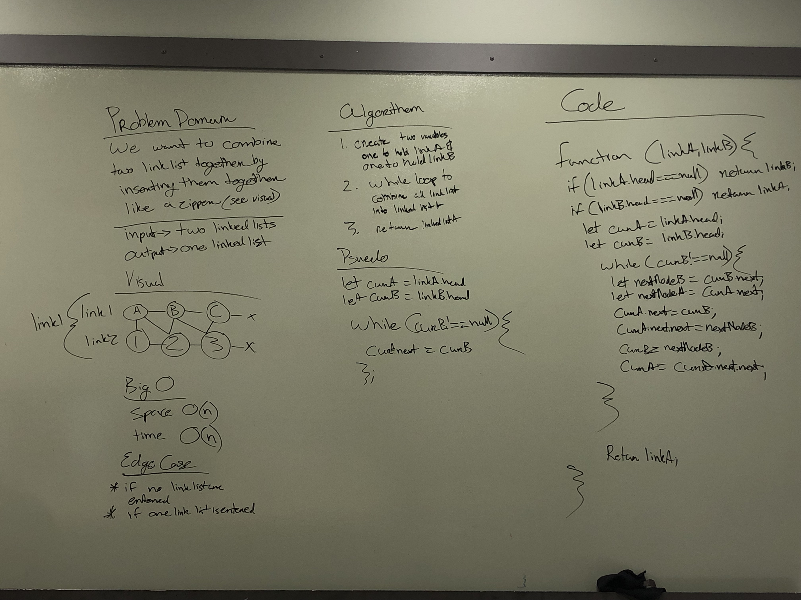

# Linked List Zipper-Merge

## Challenge
Merge both linked list by intertwining them. Ex: linklistA [1,3,5], linklistB [2,4,6] outcome -> [1,2,3,4,5,6]

## Approach & Efficiency
I want to loop through linklist A and linklist B until linklist B === null
## Solutions

