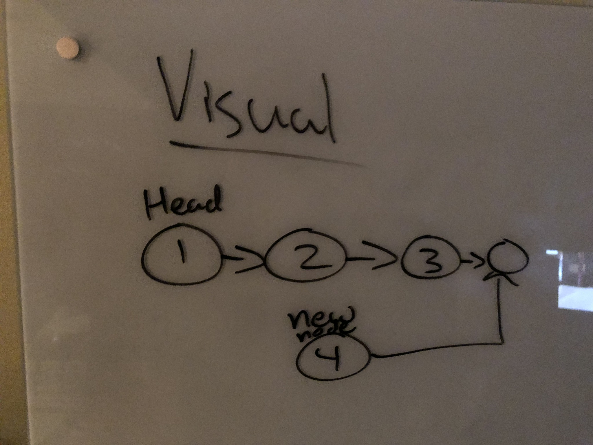
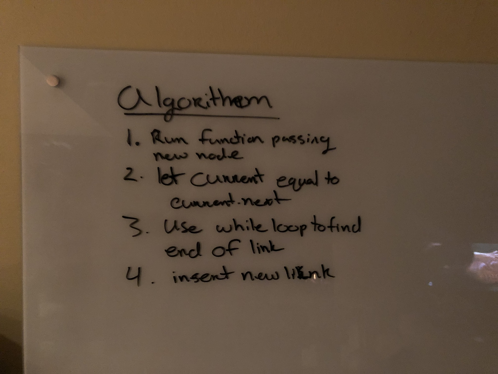
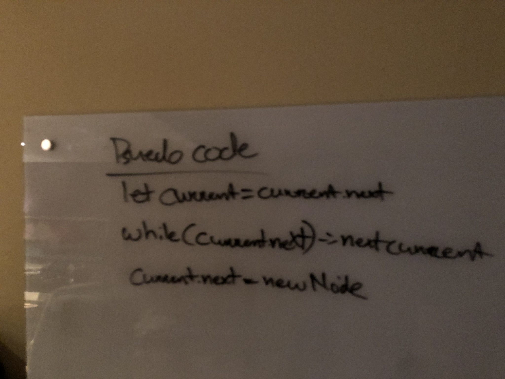
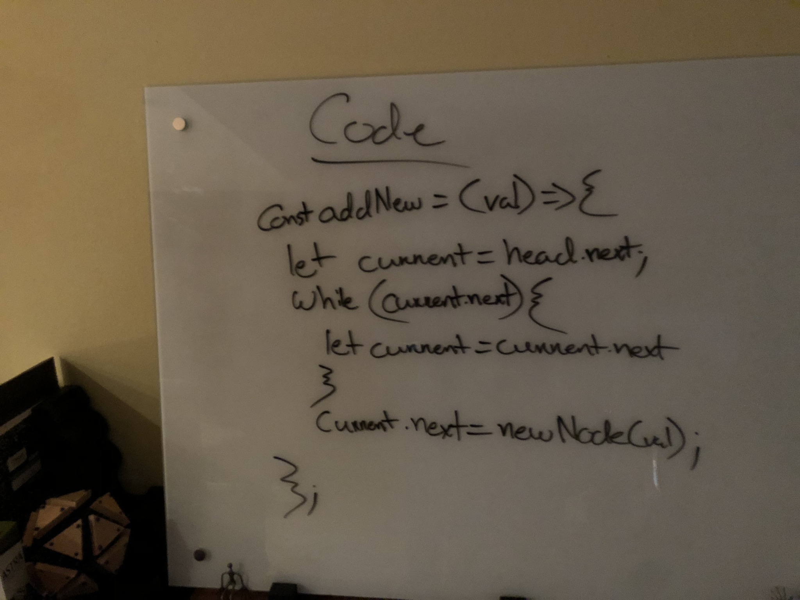

# Linked List Insertions
* Code used from Lab 3 demo
## Challenge

### Append
* create a function that inserts a new node at the end.
### Insert Before
* create a function that inserts a new node before a node value.
### Insert After
* create a function that inserts a new node after a node value.

## Approach & Efficiency

### Append
I wanted to loop through the current to the end in order to add at node to the end
### Insert Before
I wanted to loop through the linkedlist to find the value then insert new node before. If the value being searched is the head, then callback the insertAtHead function.
### Insert After
I wanted to loop through the linkedlist to fine the value being searched and then new node is inserted after.

## Solutions

### Append

### Insert Before

### Insert After

