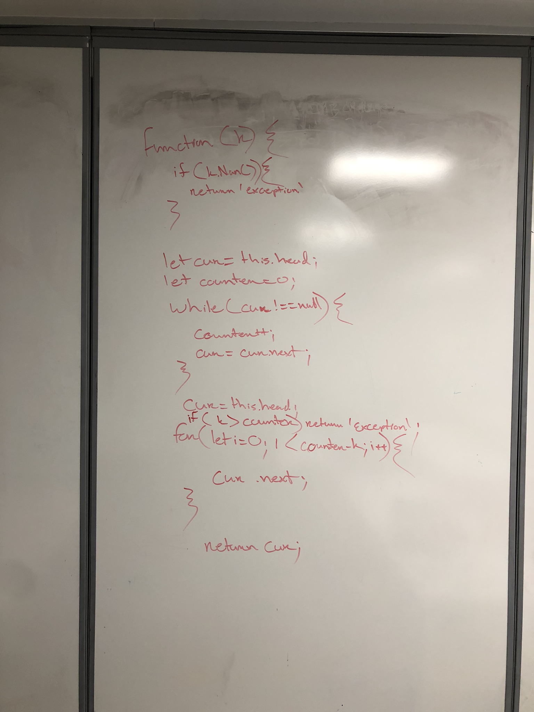

# Link List kth From End

## Challenge
create a method that can find the value of a node be counting from the tail.

## Approach & Efficiency

I want to create a while loop to find how many links are in a list. Minus the total by k to find the value of a node.

## Solutions

