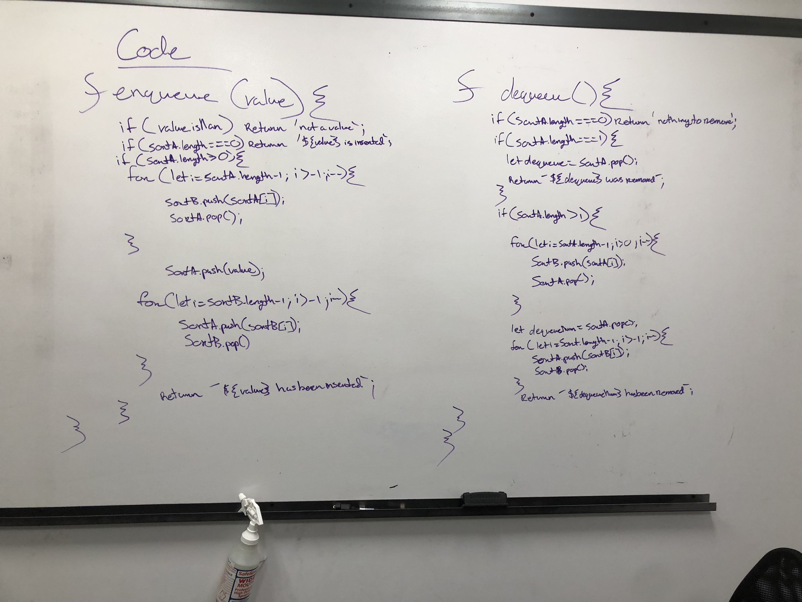
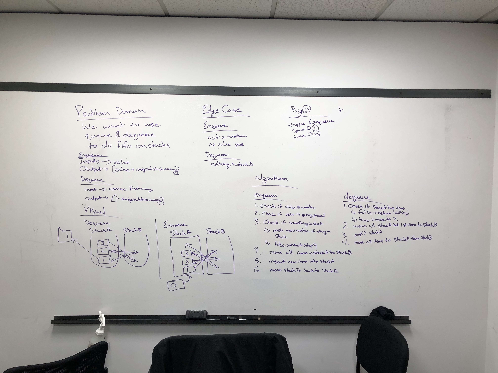

# Implement a Queue using two Stacks

## Challenge

Using enqueue and dequeue as fifo into a stack with using 2 stacks

## Approach & Efficiency
Enqueue -> I want to move everything out of stackA into stackB enter new value, then move everything back.  
Dequeue -> I want to remove everyhing but the last one out of stack A into stackB, then pop the last one, and move everything from stackB into stackA
## Solutions

