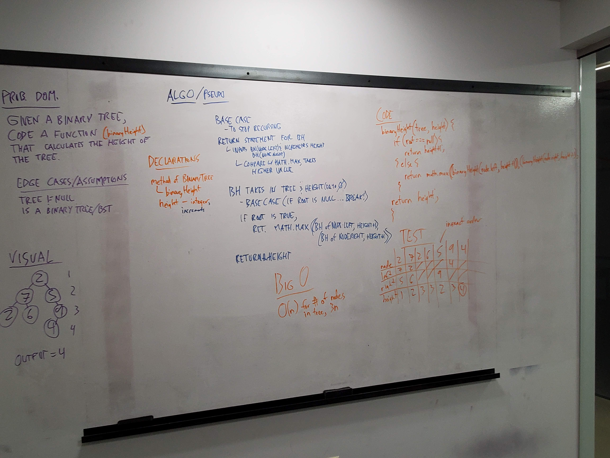

 401n12 Code Challenge 26
===
# Binary Height

## Challenge Description
Given a binary tree, code a function that calculates its height.

## Approach & Efficiency
<!-- What approach did you take? Why? What is the Big O space/time for this approach? -->

## Solution
